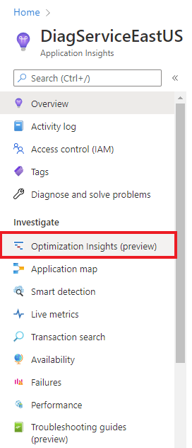
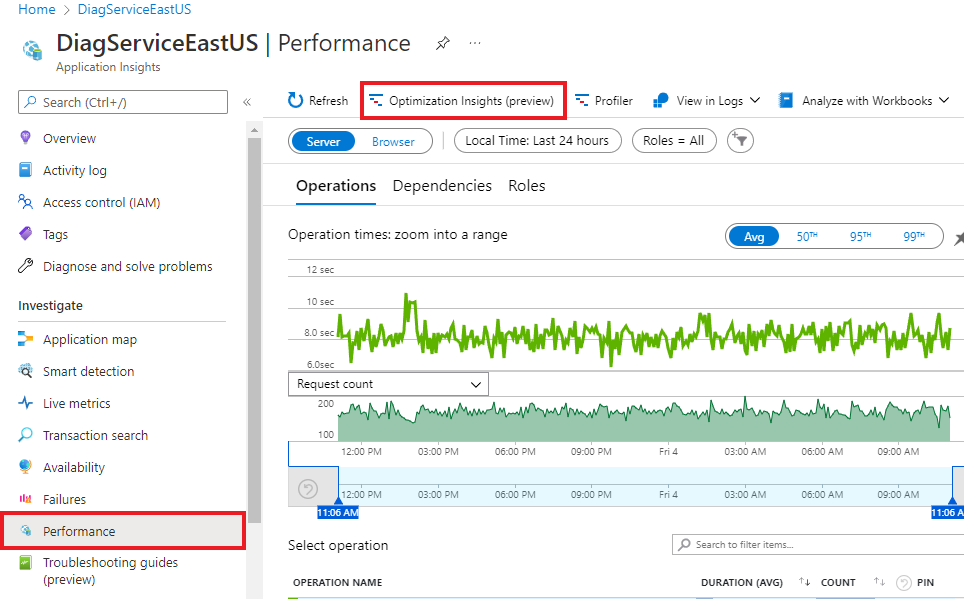
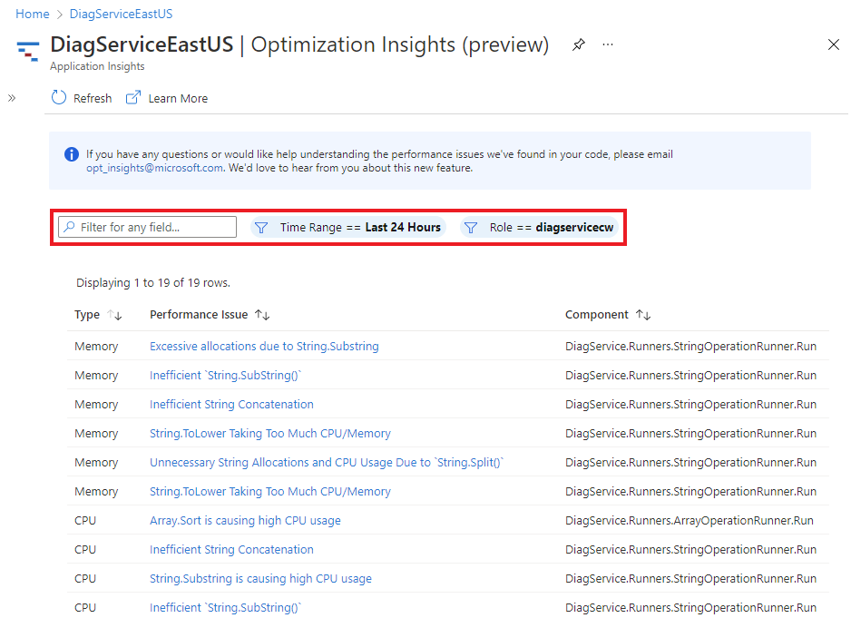
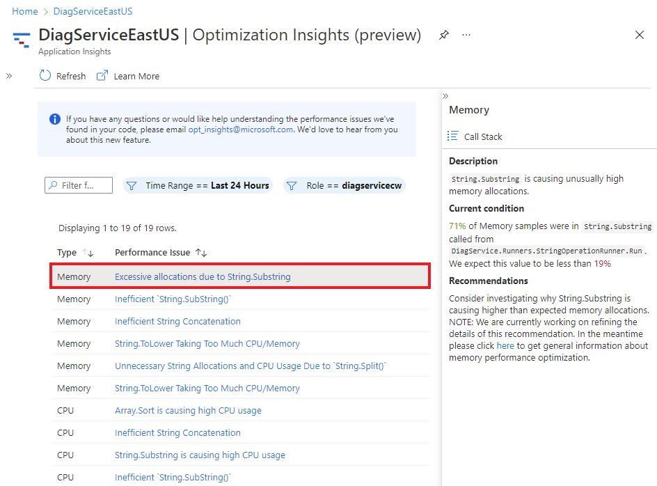
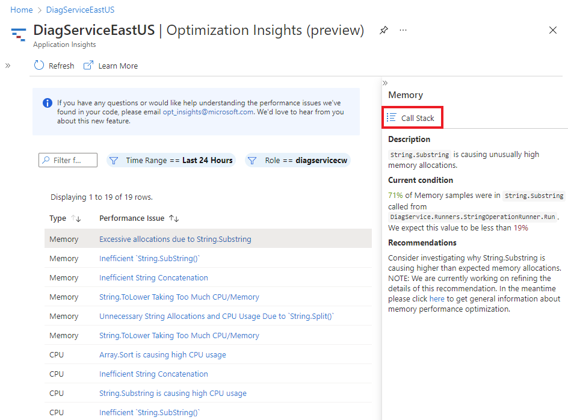
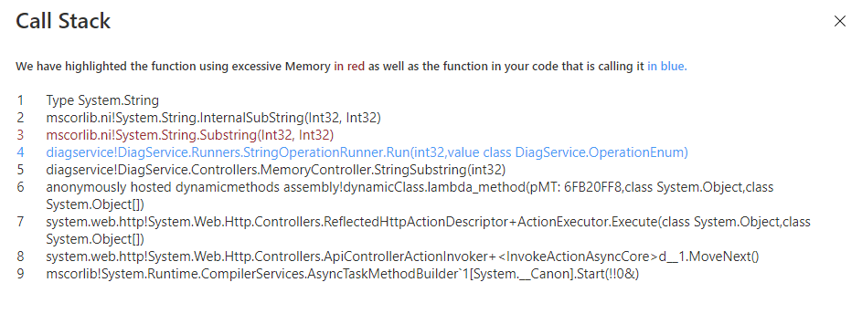

**MICROSOFT CONFIDENTIAL: All content in this repo is confidential unless otherwise stated.**

# Optimization Insights Service (Private Preview)

Azure's AI-based service, Optimization Insights, helps you identify and remove CPU and Memory bottlenecks by:

- Analyzing the runtime behavior of your application.
- Comparing the behavior to performance engineering best practices, based on lessons learned from thousands of applications profiled internally at Microsoft.

Optimization Insights service is built entirely using Azure. Behind the scenes, our system's smart-sampling agent grabs samples from the profiles captured on your app every *X* minutes. These samples are then sent to the AI model to extract the most relevant insights and recommendations.

  

## Prerequisites

Before you can use Optimization Insights on your Azure application:

- [Enable the Application Insights Profiler](https://docs.microsoft.com/en-us/azure/azure-monitor/app/profiler-overview).
- Verify your application:
  - Is written in .NET.
  - Uses [Application Insights](https://docs.microsoft.com/en-us/azure/azure-monitor/app/app-insights-overview).

## Get started with Optimization Insights

Once you've been onboarded to the private preview, you'll notice the new **Optimization Insights (preview)** tab from your resource's profiler page. Navigate to that tab to view the insights we've identified in your application over a specific period of time.

### Navigate to Optimization Insights for your application

Currently, you can only access Optimization Insights through one of the following entry points. From the resource's overview page:

- Select **Optimization Insights (preview)** under **Investigate** in the left navigation pane.

   

- Navigate to the **Performance** blade from the left navigation pane and select **Optimization Insights (preview)** from the top menu.

   

On the Optimization Insights page, you can filter the results by:

- Using the search bar to filter by field.
- Setting the time range via the **Time Range** drop-down menu.
- Selecting the corresponding role from the **Role** drop-down menu.

You can also sort columns in the insights results based on:

- Type (memory or CPU).
- Maximum CPU or memory usage (impact).
- Issue frequency within a specific time period (count).
- Corresponding role, if your service has multiple roles (role).

After sorting and filtering the Optimization Insights results, you can then select each insight to view:

- Detailed description of the performance bug insight.
- The full call stack.
- Recommendations on how to fix the performance issue.

Select the **Call Stack** button within the insight's details pane to access the full call stack surrounding the performance issue.

The call stack results should look like:

## Next Steps

- For more information regarding common questions, review our [FAQ page](faq.md).
- If you have any further questions, email the [Optimization Insights team](mailto:opt_insights@microsoft.com).
- Leave feedback for the Optimization Insights team via the [GitHub issues section of this repo](https://github.com/microsoft/optimization-insights/issues).