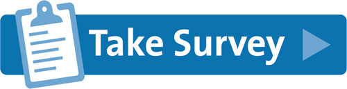

**MICROSOFT CONFIDENTIAL: All content in this repo is confidential unless otherwise stated.**

# Optimization Insights Service (Private Preview)

Optimization Insights is Azure's AI-based service that helps you identify and remove CPU and Memory bottlenecks by analyzing the runtime behavior of your application and comparing it to performance engineering best practices based on lessons learned from thousands of applications profiled internally at Microsoft. 

## Prerequisites

The following are the eligibility requirements to participate in the Optimization Insights private preview. 
1.	The application is written in .NET
2.	The application uses Application Insights.
3.	The Application Insights Profiler is enabled.

## Interested in participating?

If you already meet or could meet the aforementioned criteria, please fill out this **[survey](https://forms.office.com/Pages/ResponsePage.aspx?id=v4j5cvGGr0GRqy180BHbR2WKm-0-TPBEtsyQ96QsOPpUMlRKVU5JSkJVRTVKOFJaQTI2N1ZRTkc4Si4u)**. After completing the **[survey](https://forms.office.com/Pages/ResponsePage.aspx?id=v4j5cvGGr0GRqy180BHbR2WKm-0-TPBEtsyQ96QsOPpUMlRKVU5JSkJVRTVKOFJaQTI2N1ZRTkc4Si4u)**, we will contact you within a few days! 

## Frequently Asked Questions

#### 1. Is it required to have the Application Insights Profiler enabled in order to see the Optimization Insights?

Yes, the profiling data collected by the App Insights Profiler is used as an input to generate the Optimization Insights. If you haven't tried the App Insights Profiler yet, we encourage you to do so since it can help you diagnose performance issues in your application. Click **[here](https://docs.microsoft.com/en-us/azure/azure-monitor/app/profiler-overview)** for more details on how to enable it.

#### 2. How do Optimization Insights work under the hood?

Optimization Insights use Microsoft’s internal profiling data and Artificial Intelligence algorithms to detect performance bugs. Microsoft’s internal profiler collects random samples of stack traces from Microsoft's own services and applications running on Azure, which amount to thousands of traces collected daily. We then leverage this data to build detection techniques that can a) distinguish between what is and isn’t client’s application code in a trace, and b) tell when a function is being used inefficiently by learning best practices from thousands of .NET application traces internal to Microsoft that are currently in production.

#### 3. Does enabling Optimization Insights result in additional overhead?

There's no extra overhead because Optimization Insights work entirely offline using the profiles uploaded by the App Insights Profiler.

#### 4.	How often is the data collected? Is the data collection different from that of the App Insights Profiler? How do the trigger-based and on-demand data collection options affect Optimization Insights?

Optimization Insights use the data uploaded by the App Insights Profiler. This includes triggered collection and time-based samples. By default it's about 1 an hour. However, we look at only 1 trace per role name per hour.

#### 5.	How often should I review the Optimization Insights?

We recommend that you review the insights on a regular basis since the new performance issues can be detected based on the application load and how the application is exercised by the users. Many users check which Optimization Insights are generated when they run their load tests.

#### 6.	How do I go about prioritizing a particular recommendation provided by Optimization Insights relative to other recommendations as well as other tasks that developers need to work on?

We recommend that you prioritize issue remediation based on the values shown in the Count and Impact columns. 

#### 7.	Will I incur any additional costs for testing Optimization Insights in the private preview?

Optimization Insights are included at no additional costs for App Insights Profiler customers. However, although minor, there are indirect costs associated with running the App Insights Profiler. First, the Profiler’s metadata is sent to your App Insights resource, which Application Insights charges for. In the basic pricing plan, your application can send a certain allowance of data each month free of charge. Second, the Profiler uploads profiles to the same region where your Application Insights was created. Therefore, if your application is running in a different region than that of your App Insights resource, we have to send profiler data across different regions. As a result, although very small, you will incur networking costs. 

#### 8. Will Optimization Insights continue to be free once it becomes generally available?
We will provide more information on this topic once the product becomes generally available.

#### 9. What does the roadmap for Optimization Insights look like?
The roadmap for Optimization Insights is not currently public. However, we are continuously working on making the product better and would love to hear your feedback! If you have any suggestions or questions, please send us an email at **opt_insights@microsoft.com**.

#### 10. How long does it take for the Optimization Insights to appear in the UI after the profiler data is collected? 
The Optimization Insights are shown in near real time as the profiler data is ingested and analyzed.

## Trademarks

This project may contain trademarks or logos for projects, products, or services. Authorized use of Microsoft 
trademarks or logos is subject to and must follow 
**[Microsoft's Trademark & Brand Guidelines](https://www.microsoft.com/en-us/legal/intellectualproperty/trademarks/usage/general)**.
Use of Microsoft trademarks or logos in modified versions of this project must not cause confusion or imply Microsoft sponsorship.
Any use of third-party trademarks or logos are subject to those third-party's policies.
